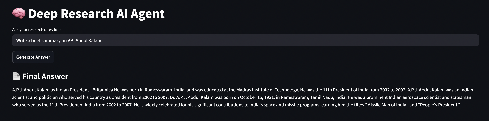
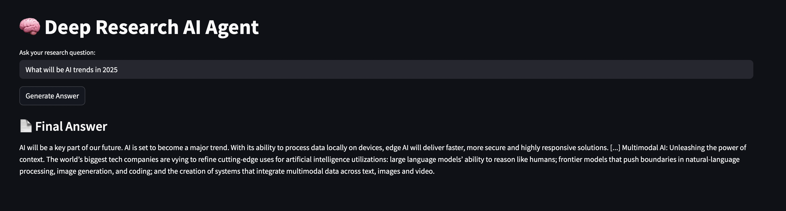

# 🤖 Deep Research AI Agentic System

An intelligent, dual-agent system that performs deep research and drafts precise summaries using LangGraph, LangChain, Hugging Face models, and a Streamlit UI.


---

## 🚀 Project Overview

This project was developed to explore multi-agent AI systems for web research and summarization. My goal was to create an intelligent, dual-agent system that could perform real-time research and draft summarized insights automatically. I explored agent-based architecture using LangGraph and LangChain, while integrating external APIs like Tavily and models from Hugging Face.

The system includes:
- 📡 **Agent 1**: Collects real-time information from the web using the Tavily API.
- 🧠 **Agent 2**: Summarizes or answers questions using models like `flan-t5-base` from Hugging Face.
- 🔄 LangGraph manages the orchestration between the agents.
- 🌐 A simple and interactive **Streamlit UI** lets users submit queries and view results.

---

## 📂 Project Structure

```bash
deep-research-agent/
├── agents/
│   ├── research_agent.py
│   └── answer_drafter_agent.py
├── main.py              # LangGraph pipeline
├── streamlit_app.py     # Streamlit UI
├── .env                 # API keys (TAVILY_API_KEY)
├── requirements.txt
└── README.md
```

---

## 🛠️ How It Works

Here's how the system works step-by-step:

1. The user submits a research question using the terminal or Streamlit UI.
2. LangGraph activates **Agent 1**, which performs a live web search using Tavily.
3. The retrieved context is passed to **Agent 2**, which uses a Hugging Face model to summarize or answer.
4. The final response is displayed in a user-friendly format.

I tested the full pipeline extensively and learned how to handle token limitations, prompt design, and response formatting during the build.

---

## 🧑‍💻 Installation

```bash
conda create -n deepresearch python=3.10
conda activate deepresearch
pip install -r requirements.txt
```

---

🔐 **.env Format**

```bash
TAVILY_API_KEY=your_tavily_key_here
```

---

## ▶️ Running the Project

### 🧪 Terminal Mode
```bash
python main.py
```

### 🌐 Streamlit UI
```bash
streamlit run streamlit_app.py
```

---

## 🧠 Technologies Used

- **LangGraph** – Agentic workflow orchestration.
- **LangChain** – Tool creation and memory (Tavily tool).
- **Hugging Face Transformers** – `flan-t5-base` for summarization.
- **Streamlit** – Web interface.
- **Python-dotenv** – Secure API management.

---

## 🧪 Model Usage Notes

This project was optimized primarily for **summarization tasks**, especially for open-ended research-style questions using the `flan-t5-base` model from Hugging Face.

However, I also explored **fact-based question answering** using a second version:

- 🧾 Use `answer_drafter_agent_QA.py` for better QA performance.
- 🔁 In `main.py`, just replace line 31 with:

```python
answer = generate_answer(context, state["query"])
```

This swaps the summarizer with a QA model like `deepset/roberta-base-squad2`, which works better for direct questions like "Who won the IPL in 2018?".

## 🖼️ Screenshots

### 🔹 Streamlit Demo - Input/Output





---
